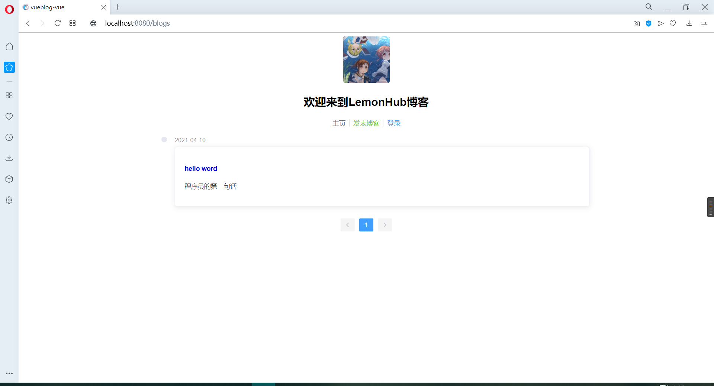
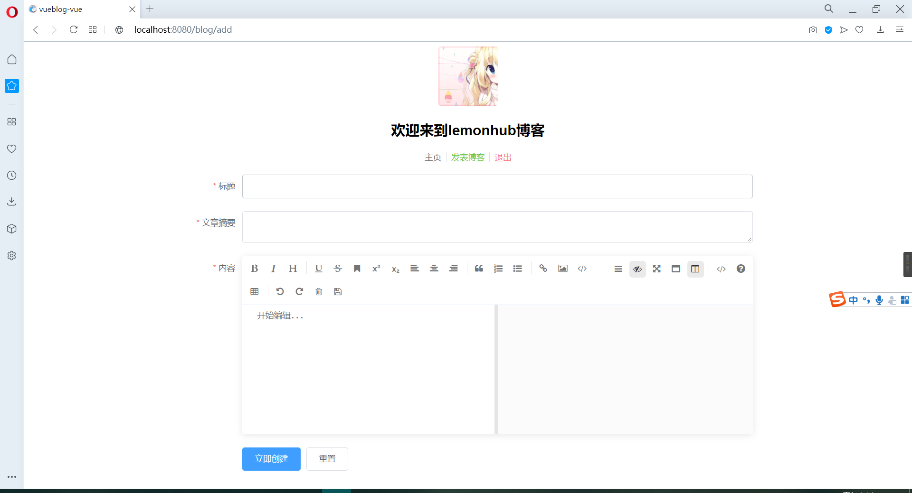
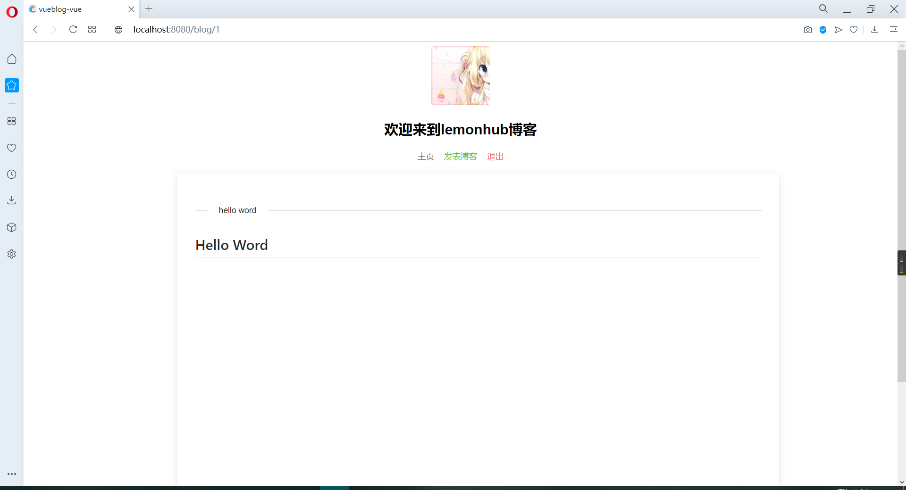
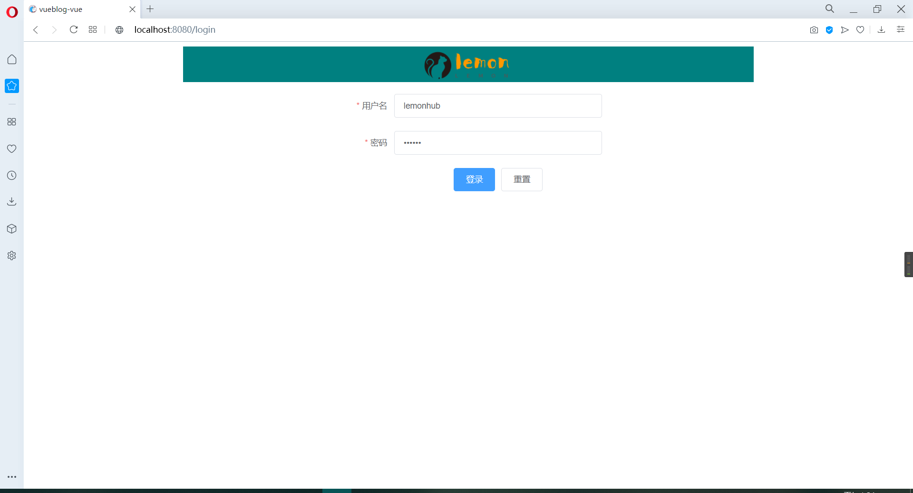

# 一个简单的SpringBoot+vue前后端分离博客项目！！

后端项目文件：vueblog，vue项目文件：vueblog-vue，数据库脚本文件：vueblog.sql

项目展示：

>  首页



> 发布博客



> 文章详情



> 登录页面




## 后端

>  后端使用的技术栈

- SpringBoot
- mybatis plus
- shiro
- lombok
- redis
- hibernate validatior
- jwt

> 后端主要功能

封装数据接口、身份校验和授权、异常处理通知、跨域处理

> 封装数据接口

封装返回数据格式

```java
package cn.lemon.common.lang;

import lombok.Data;

@Data
public class Result {
    private int code;//状态码
    private String msg;//消息
    private Object data;//内容

    public static Result succ(int code,String msg,Object data){
        Result r = new Result();
        r.setCode(code);
        r.setMsg(msg);
        r.setData(data);
        return r;
    }

    public static Result succ(Object data){
        return succ(200,"操作成功",data);
    }

    public static Result fail(int code,String msg,Object data){
        Result r = new Result();
        r.setCode(code);
        r.setMsg(msg);
        r.setData(data);
        return r;
    }

    public static Result fail(String msg,Object data){
        return fail(400,msg,data);
    }

    public static Result fail(String msg){
        return fail(400,msg,null);
    }
}
```

> 身份校验和授权

使用shiro进行jwt认证和管理权限

```java
package cn.lemon.shiro;

import cn.hutool.json.JSONUtil;
import cn.lemon.common.lang.Result;
import cn.lemon.util.JwtUtils;
import io.jsonwebtoken.Claims;
import org.apache.shiro.authc.AuthenticationException;
import org.apache.shiro.authc.AuthenticationToken;
import org.apache.shiro.authc.ExpiredCredentialsException;
import org.apache.shiro.web.filter.authc.AuthenticatingFilter;
import org.apache.shiro.web.util.WebUtils;
import org.springframework.beans.factory.annotation.Autowired;
import org.springframework.stereotype.Component;
import org.springframework.util.StringUtils;
import org.springframework.web.bind.annotation.RequestMethod;

import javax.servlet.ServletRequest;
import javax.servlet.ServletResponse;
import javax.servlet.http.HttpServletRequest;
import javax.servlet.http.HttpServletResponse;
import java.io.IOException;

@Component
public class JwtFilter extends AuthenticatingFilter {

    @Autowired
    JwtUtils jwtUtils;

    @Override
    protected AuthenticationToken createToken(ServletRequest servletRequest, ServletResponse servletResponse) throws Exception {
        HttpServletRequest request = (HttpServletRequest) servletRequest;
        String jwt = request.getHeader("Authorization");
        /*if (StringUtils.isEmpty(jwt))
            return null;*/
        return StringUtils.isEmpty(jwt)? null:new JwtToken(jwt);
    }

    @Override
    protected boolean onAccessDenied(ServletRequest servletRequest, ServletResponse servletResponse) throws Exception {
        HttpServletRequest request = (HttpServletRequest) servletRequest;
        String jwt = request.getHeader("Authorization");
        if (StringUtils.isEmpty(jwt)){
            return true;
        }else {
            //校验
            Claims claim = jwtUtils.getClaimByToken(jwt);
            if (claim == null || jwtUtils.isTokenExpired(claim.getExpiration())){
                throw new ExpiredCredentialsException("Token已失效，请重新登录");
            }
            //执行登录
            return executeLogin(servletRequest,servletResponse);
        }
    }

    @Override
    protected boolean onLoginFailure(AuthenticationToken token, AuthenticationException e, ServletRequest request, ServletResponse response) {
        HttpServletResponse httpServletResponse = (HttpServletResponse) response;
        Throwable throwable = e.getCause() == null? e:e.getCause();
        Result result = Result.fail(throwable.getMessage());
        String json = JSONUtil.toJsonStr(request);
        try {
            httpServletResponse.getWriter().print(json);
        } catch (IOException ioException) {

        }
        return false;
    }

    @Override
    public boolean onPreHandle(ServletRequest request, ServletResponse response, Object mappedValue) throws Exception {
        HttpServletRequest httpServletRequest = WebUtils.toHttp(request);
        HttpServletResponse httpServletResponse = WebUtils.toHttp(response);
        httpServletResponse.setHeader("Access-control-Allow-Origin", httpServletRequest.getHeader("Origin"));
        httpServletResponse.setHeader("Access-Control-Allow-Methods", "GET,POST,OPTIONS,PUT,DELETE");
        httpServletResponse.setHeader("Access-Control-Allow-Headers", httpServletRequest.getHeader("Access-Control-Request-Headers"));
        // 跨域时会首先发送一个OPTIONS请求，这里我们给OPTIONS请求直接返回正常状态
        if (httpServletRequest.getMethod().equals(RequestMethod.OPTIONS.name())) {
            httpServletResponse.setStatus(org.springframework.http.HttpStatus.OK.value());
            return false;
        }
        return super.onPreHandle(request, response, mappedValue);
    }
}

```

>  异常处理通知

```java
package cn.lemon.common.exception;

import cn.lemon.common.lang.Result;
import lombok.extern.slf4j.Slf4j;
import org.apache.shiro.ShiroException;
import org.springframework.http.HttpStatus;
import org.springframework.validation.BindingResult;
import org.springframework.validation.ObjectError;
import org.springframework.web.bind.MethodArgumentNotValidException;
import org.springframework.web.bind.annotation.ExceptionHandler;
import org.springframework.web.bind.annotation.ResponseStatus;
import org.springframework.web.bind.annotation.RestControllerAdvice;
@Slf4j
@RestControllerAdvice
public class GlobalExceptionHandler {

    @ResponseStatus(HttpStatus.UNAUTHORIZED)
    @ExceptionHandler(value = ShiroException.class)
    public Result handler(ShiroException e){
        log.error("---------运行时异常---------",e);
        return Result.fail(401,e.getMessage(),null);
    }

    @ResponseStatus(HttpStatus.BAD_REQUEST)
    @ExceptionHandler(value = RuntimeException.class)
    public Result handler(RuntimeException e){
        log.error("---------运行时异常---------",e);
        return Result.fail(e.getMessage());
    }

    @ResponseStatus(HttpStatus.BAD_REQUEST)
    @ExceptionHandler(value = MethodArgumentNotValidException.class)
    public Result handler(MethodArgumentNotValidException e){
        log.error("---------实体校验异常---------",e);
        BindingResult bindingResult = e.getBindingResult();
        ObjectError objectError = bindingResult.getAllErrors().stream().findFirst().get();
        return Result.fail(objectError.getDefaultMessage());
    }

    @ResponseStatus(HttpStatus.BAD_REQUEST)
    @ExceptionHandler(value = IllegalArgumentException.class)
    public Result handler(IllegalArgumentException e){
        log.error("---------Assert异常---------",e);
        return Result.fail(e.getMessage());
    }

}
```

> 跨域处理

```java
package cn.lemon.config;

import org.springframework.context.annotation.Configuration;
import org.springframework.web.servlet.config.annotation.CorsRegistry;
import org.springframework.web.servlet.config.annotation.WebMvcConfigurer;

/**
 * 解决跨域问题
 */
@Configuration
public class CorsConfig implements WebMvcConfigurer {
    @Override
    public void addCorsMappings(CorsRegistry registry) {
        registry.addMapping("/**")
                .allowedOriginPatterns("*")
                .allowedMethods("GET", "HEAD", "POST", "PUT", "DELETE", "OPTIONS")
                .allowCredentials(true)
                .maxAge(3600)
                .allowedHeaders("*");
    }
}

```

## 前端

使用到的技术：

- vue
- element-ui
- axios
- mavon-editor
- markdown-it
- github-markdown-css

后面三个主要用来做富文本编辑器

> 前端主要功能

调用接口展示数据，路由拦截、富文本编辑和展示

> 富文本编辑和展示

使用`npm`下载mavon-editor、markdown-it、github-markdown-css 组件

```
#用于编辑md文档
npm install mavon-editor --save
# 用于解析md文档
cnpm install markdown-it --save
# md样式
cnpm install github-markdown-css
```

> mavon-editor

在`HTML` 添加 `<mavon-editor></mavon-editor>` 标签即可生成markdown编辑工具

> markdown-it

用于解析markdown语法变成html，在axios接收到的md数据，利用markdown-it的方法解析成HTML

```javascript
const MarkdownIt = require("markdown-it")
const md = new MarkdownIt()
const result = md.render(接收到的md文档)
```

> github-markdown-css

在markdown容器上添加class样式 `class="markdown-body"` 即可生成md样式

```html
<div v-html="content" class="markdown-body"></div>
```


